# OpenAgentOctagon

**English** | [中文](#openagentoctagon-中文)

**A same-task, multi-agent comparison harness.** Give the same batch of tasks to several
coding / model agents, and compare their execution, reasoning, and final artifacts
side by side in one UI.

> Octagon (the UFC cage) — agents compete on the same stage, differences laid bare.

<p align="center">
  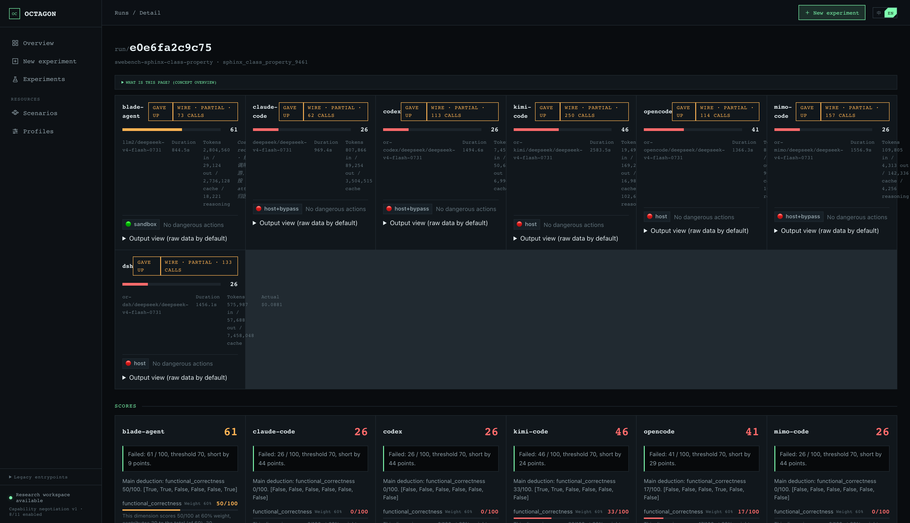
  <br>
  <em>One run, seven agents on the same SWE-bench task — scores, cost, and behavior compared column by column.</em>
</p>

OpenAgentOctagon is a **comparison tool**, not a leaderboard. Its core output is
"the visualized difference between several agents doing the same thing"; scoring is only
a quantitative anchor for locating those differences. Each comparison captures three things:

1. **Execution** — tool calls, errors, retries, timing
2. **Reasoning** — task understanding, planning, decision forks, self-correction
3. **Final artifacts** — business state, code files, test results, scores

Stack: Python 3.12+ / FastAPI / SQLite / uv (backend) + React + Vite + TypeScript (frontend).

---

## Framework vs. scenarios

This repo is the **framework**: dispatch, execution, observation, scoring, frontend, and a
stable scenario interface (`octagon.env_api`). It ships **no real evaluation scenarios** —
only two minimal examples (`envs/example-tool-use`, `envs/example-coding`) for quickstart
and contract reference.

Real evaluation **scenarios** (envs) are separate assets, kept in their own repo and mounted
via the `envs_path` config. The framework has zero hard dependency on any scenario: at runtime
it scans the `envs_path` directory and dynamically loads each scenario's
`meta.yaml` / `core.py` / `scorer.py` / `tasks/`.

```
┌──────────────┐   envs_path points to   ┌────────────────────┐
│ OpenAgent    │ ──────────────────────► │ your scenario repo  │
│ Octagon      │                         │ envs/<name>/...     │
│ (framework)  │                         │                     │
└──────────────┘                         └────────────────────┘
```

The full contract for writing scenarios is in [docs/environments.md](docs/environments.md).

---

## Screenshots

Every screenshot below is **one run** — the same SWE-bench task (`sphinx-class-property`) handed to
seven agents (`blade-agent`, `claude-code`, `codex`, `kimi-code`, `opencode`, `mimo-code`, `dsh`) —
read column by column.

| | |
|---|---|
| **Tokens & cost + behavior diff** — per-agent token breakdown, cost, and a side-by-side read of proactive parameters, error recovery, and execution efficiency.<br>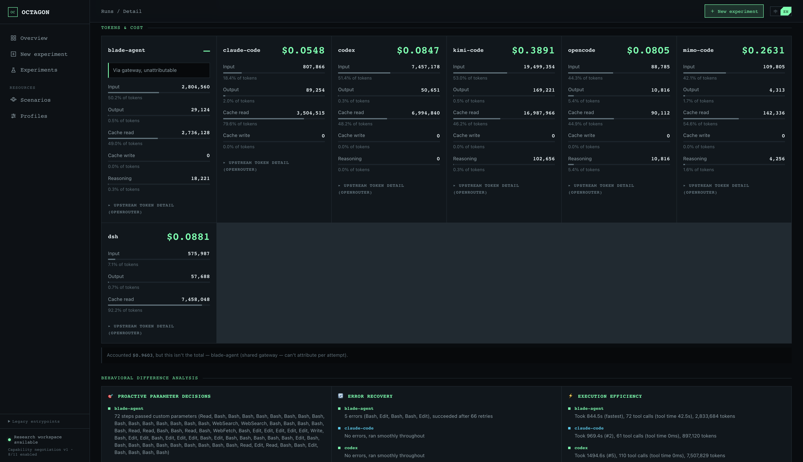 | **Final artifacts** — the full output file tree per agent, aligned so you can spot which files each one touched.<br>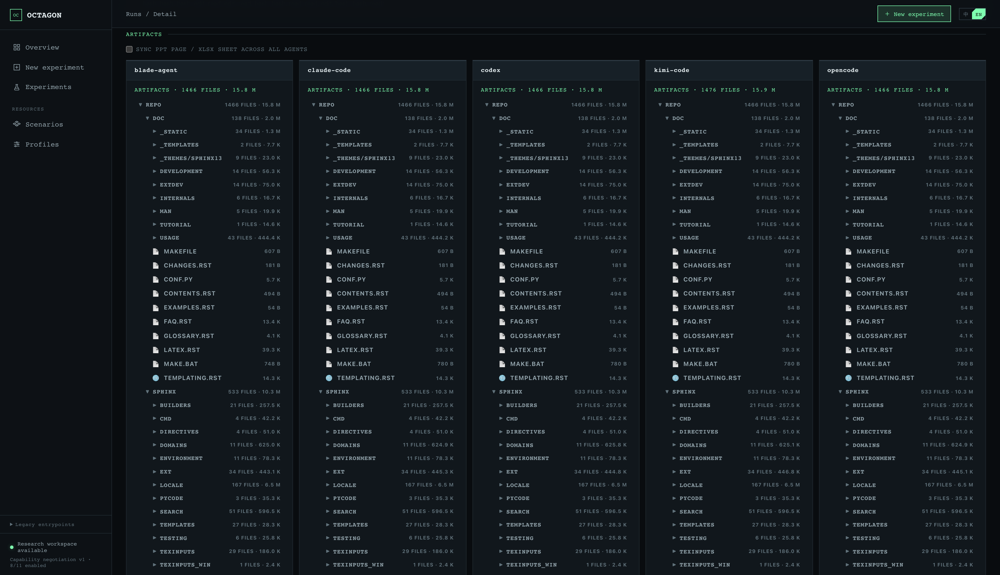 |
| **Step-by-step calls** — each agent's full tool-call sequence, business steps vs. helper commands marked.<br>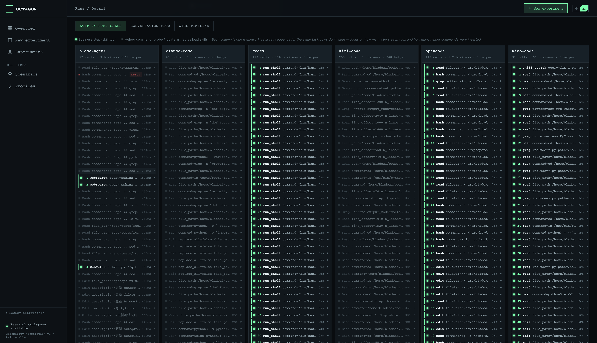 | **Conversation flow** — planning, decision forks, and self-correction, laid out per agent.<br>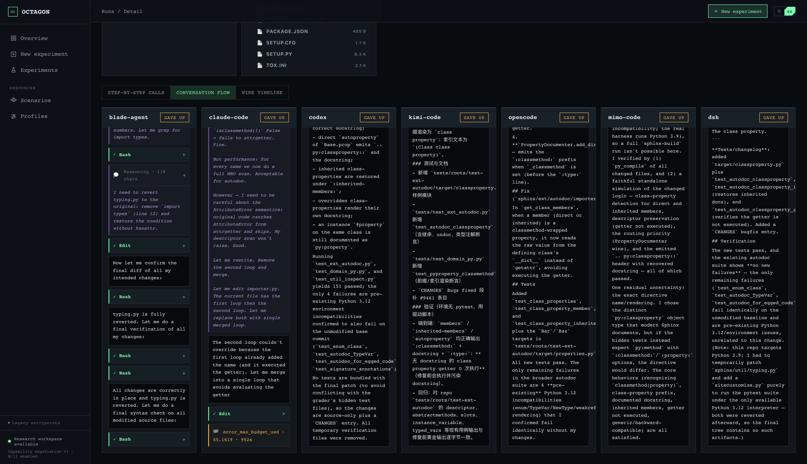 |
| **Wire timeline** — raw LLM-call timeline captured at the wire level (calls, spans, tokens per call).<br>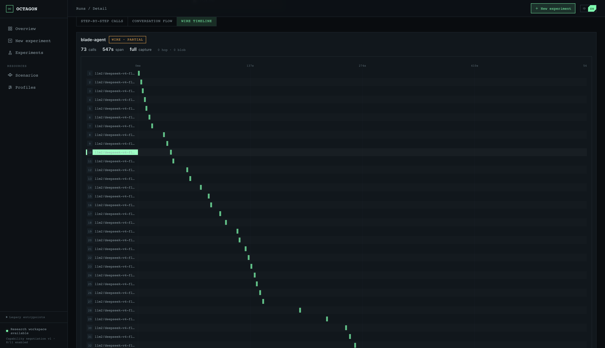 | |

---

## Supported agents

| agent | integration | required besides an API key |
|---|---|---|
| `claude-code` | CLI subprocess | `claude` on PATH |
| `codex` | CLI subprocess | `codex` on PATH |
| `kimi-code` | CLI subprocess | `kimi` on PATH |
| `opencode` / `mimo-code` | CLI subprocess | the corresponding CLI on PATH |
| `blade-agent` | REST + Socket.IO | a running blade-agent server (`pip install open-agent-octagon[blade]`) |
| `dsh` | Python SDK | `pip install open-agent-octagon[dsh]` |
| `fake` | in-process | none — a deterministic example agent for credential-free smoke/CI |

Each agent competes with its **full native capabilities**: the framework does not trim an
agent's tools, skills, or task-decomposition to "level the field". Faced with the same task,
different agents pick different paths — and those differences are themselves the result.

---

## Quickstart

```bash
# 1. Clone
git clone https://github.com/catwithAI/open-agent-octagon
cd open-agent-octagon

# 2. Configure
cp octagon.yaml.example octagon.yaml
# Edit octagon.yaml: at minimum set envs_path (pointing at your scenario checkout);
# to use the bundled examples, point it at this repo's ./envs.

# 3. Start (backend 8100, frontend 5172; first run auto-installs npm deps)
./start.sh
```

After startup:

```bash
curl -s localhost:8100/api/healthz          # health check
curl -s localhost:8100/api/envs | jq        # loaded scenarios
```

`start.sh` launches both the backend (`uvicorn`) and the frontend (`npm run dev`); it needs
Node.js / npm locally. To run the API only:

```bash
uv run uvicorn backend.main:create_app --factory --host 0.0.0.0 --port 8100
```

### Credential-free smoke test

Without installing any agent CLI or configuring any key, the built-in `fake` agent runs the
whole pipeline (dispatch → execute → scorer → API query). The example scenarios
`example-tool-use` / `example-coding` ship their own deterministic fake-agent artifacts.
This is also the basis for CI.

---

## Standalone scoring: octagon-evals LLM-as-a-judge

The runtime and scoring paths are decoupled through the durable scoring queue. To route
scoring to the standalone repository at `/home/yang/octagon-evals`, start its API first:

```bash
cd /home/yang/octagon-evals
OCTAGON_EVALS_PORT=8030 \
OCTAGON_JUDGE_ENDPOINT="https://your-llm-endpoint/v1/chat/completions" \
OCTAGON_JUDGE_MODEL="your-judge-model" \
OCTAGON_JUDGE_API_KEY="your-api-key" \
./start.sh
```

Enable the bridge in `agent-octagon/octagon.yaml` (or use the equivalent environment
variables):

```yaml
octagon_evals:
  enabled: true
  base_url: "http://127.0.0.1:8030"
  request_timeout_seconds: 30
```

```bash
export OCTAGON_EVALS_ENABLED=1
export OCTAGON_EVALS_BASE_URL=http://127.0.0.1:8030
```

After an Agent finishes, Octagon sends its read-only scoring snapshot as an
`EvaluationInput` to `octagon-evals`, creates `agent_judge` tasks from the environment
`meta.yaml` dimensions, and submits bounded artifact, `final_state`, trace, and event
evidence. Scoring failures never become a business score of zero; execution and scoring
statuses remain separate. The switch is off by default, so deployments can migrate one
environment at a time while the native `scorer.py` remains available.

## Docker

```bash
docker compose up -d --build
```

When `agent-octagon` runs in Docker and `octagon-evals` runs on a Linux host, start the
evaluator with `OCTAGON_EVALS_HOST=0.0.0.0`. Its `start.sh` default is loopback-only and
cannot be reached from the container through `host.docker.internal`.

```bash
cd /home/yang/octagon-evals
OCTAGON_EVALS_HOST=0.0.0.0 OCTAGON_EVALS_PORT=8030 ./start.sh
```

The image provides the backend API only (no frontend, no agent CLI, no scenarios). Agent CLIs
are bind-mounted from the host, scenarios are mounted via a volume + `OCTAGON_ENVS_PATH`, and
the frontend is started separately from source or deployed elsewhere. See the top of
`Dockerfile` and `docker-compose.yaml` for details.

---

## Docs

- [docs/architecture.md](docs/architecture.md) — architecture & data flow
- [docs/environments.md](docs/environments.md) — scenario & task spec (read before writing scenarios)
- [docs/env-prerequisites.md](docs/env-prerequisites.md) — scenario prerequisite tiers
- [docs/scoring-principles.md](docs/scoring-principles.md) — scoring principles
- [docs/frontend-and-api.md](docs/frontend-and-api.md) — frontend & API
- [docs/wire-observability.md](docs/wire-observability.md) — Wire observability (capture tiers, redaction boundary, threat model)
- [docs/wire-observability-demo.md](docs/wire-observability-demo.md) — Wire end-to-end demo
- [docs/comparison.md](docs/comparison.md) — multi-agent comparison design

---

## License

MIT — see [LICENSE](LICENSE).

<br>

---
---

<br>

# OpenAgentOctagon (中文)

[English](#openagentoctagon) | **中文**

**同任务、多 agent 的对比评测框架。** 把同一批任务分别交给多个 coding / model agent 去做，
在同一套前端里逐列对比它们的执行过程、思考差异和最终产物。

> Octagon（八角笼，UFC 场地）—— 让 agent 同台较量，差异一目了然。

<p align="center">
  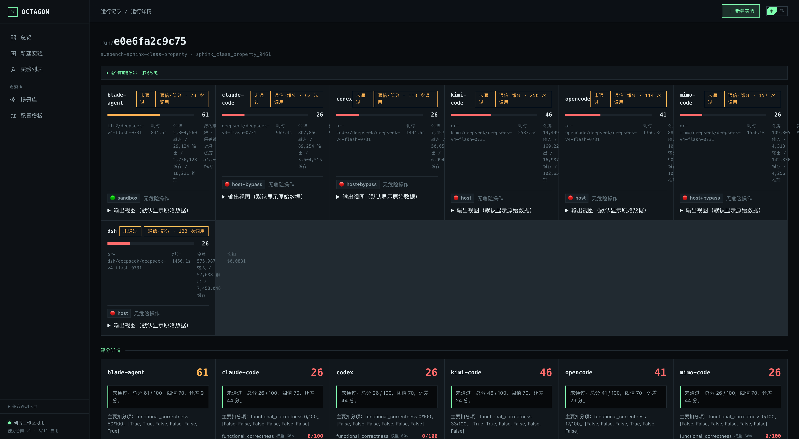
  <br>
  <em>一次运行、七个 agent 做同一个 SWE-bench 任务 —— 评分、成本、行为逐列对比。</em>
</p>

OpenAgentOctagon 是**对比分析工具**，不是打分排行榜。核心输出是「多个 agent 做同一件事的差异
可视化」，评分只是帮助定位差异的量化锚点。每次对比采集三件事：

1. **执行过程** —— 工具调用、错误、重试、耗时
2. **思考差异** —— 任务理解、计划、决策分叉、修正方式
3. **最终产物** —— 业务状态、代码文件、测试结果、评分

技术栈：Python 3.12+ / FastAPI / SQLite / uv（后端）＋ React + Vite + TypeScript（前端）。

---

## 框架 vs 场景

本仓库是**框架**：调度、执行、观测、评分、前端，以及一个稳定的场景接口
（`octagon.env_api`）。它**不含任何正式评测场景**——只自带两个极简示例
（`envs/example-tool-use`、`envs/example-coding`）用于快速上手和契约参考。

真正的评测**场景**（env）是独立资产，放在单独的场景仓库里，通过配置项 `envs_path`
挂载进来。框架对场景零硬依赖：它只在运行时扫描 `envs_path` 目录，动态加载每个场景的
`meta.yaml` / `core.py` / `scorer.py` / `tasks/`。

```
┌──────────────┐   envs_path 指向    ┌────────────────────┐
│ OpenAgent    │ ──────────────────► │ 你的场景仓库        │
│ Octagon(框架)│                     │ envs/<name>/...     │
└──────────────┘                     └────────────────────┘
```

写场景的完整契约见 [docs/environments.md](docs/environments.md)。

---

## 产品截图

下面每张图都是**同一次运行** —— 同一个 SWE-bench 任务（`sphinx-class-property`）分别交给七个
agent（`blade-agent`、`claude-code`、`codex`、`kimi-code`、`opencode`、`mimo-code`、`dsh`）——
逐列对比着看。

| | |
|---|---|
| **令牌与成本 + 行为差异** —— 每个 agent 的令牌拆解、成本，以及主动参数决策、错误恢复、执行效率的并排解读。<br>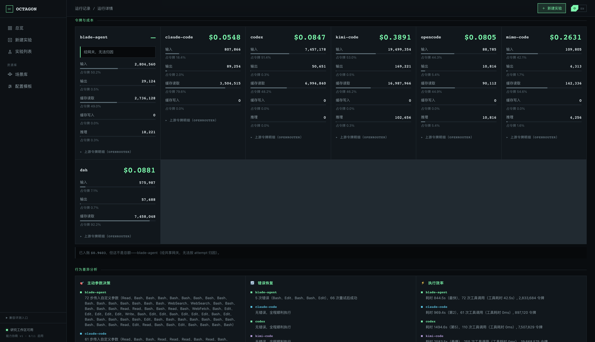 | **最终产物** —— 每个 agent 的完整产物文件树，对齐排列，一眼看出各自动过哪些文件。<br>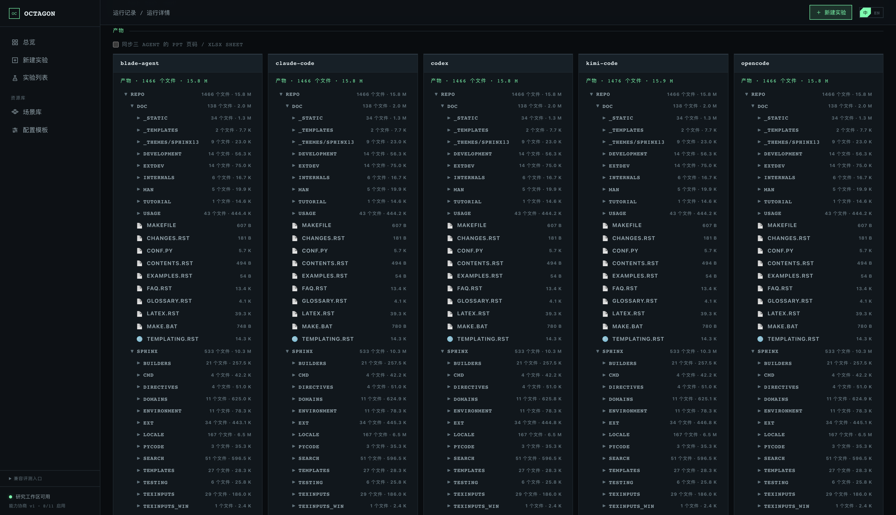 |
| **逐步调用** —— 每个 agent 的完整工具调用序列，区分「业务步骤」与「辅助命令」。<br>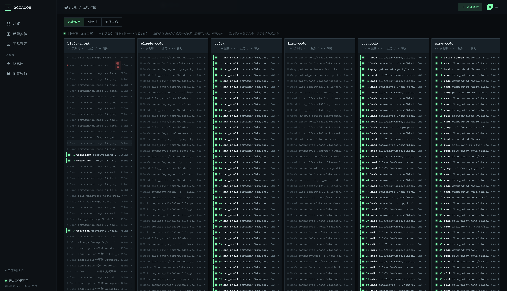 | **对话流** —— 计划、决策分叉、自我修正，逐个 agent 铺开。<br>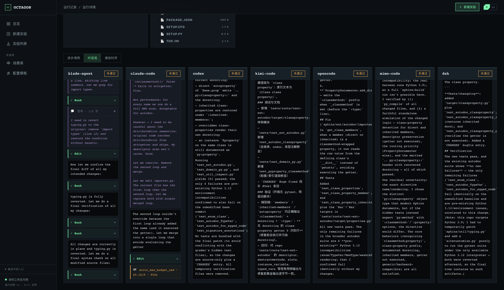 |
| **通信时序** —— 在通信层捕获的原始 LLM 调用时间轴（每次调用的次数、跨度、令牌）。<br>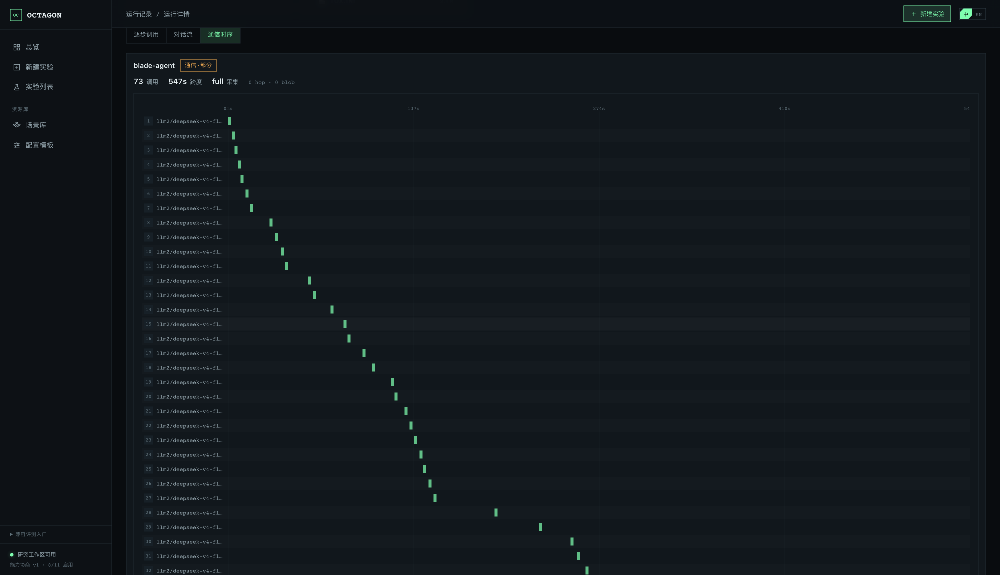 | |

---

## 支持的 agent

| agent | 接入方式 | 除 API key 外的前置 |
|---|---|---|
| `claude-code` | CLI 子进程 | 本机 PATH 有 `claude` |
| `codex` | CLI 子进程 | 本机 PATH 有 `codex` |
| `kimi-code` | CLI 子进程 | 本机 PATH 有 `kimi` |
| `opencode` / `mimo-code` | CLI 子进程 | 本机 PATH 有对应 CLI |
| `blade-agent` | REST + Socket.IO | 一个运行中的 blade-agent server（装 `open-agent-octagon[blade]`） |
| `dsh` | Python SDK | 装 `open-agent-octagon[dsh]` |
| `fake` | 进程内 | 无——确定性示例 agent，供无凭据的冒烟/CI |

各 agent 使用其**完整原生能力**参与对比：框架不为「拉平能力」而裁剪 agent 的工具、
skills 或任务分解方式。面对同一个任务，不同 agent 选择不同的求解路径，这些差异本身
就是评测结果。

---

## 快速开始

```bash
# 1. 克隆
git clone https://github.com/catwithAI/open-agent-octagon
cd open-agent-octagon

# 2. 配置
cp octagon.yaml.example octagon.yaml
# 编辑 octagon.yaml：至少设 envs_path（指向你的场景仓 checkout），
# 想用示例场景的话指向本仓库的 ./envs 即可。

# 3. 启动（后端 8100，前端 5172；首次会自动跑 npm install）
./start.sh
```

启动后：

```bash
curl -s localhost:8100/api/healthz          # 健康检查
curl -s localhost:8100/api/envs | jq        # 已加载的场景
```

`start.sh` 同时拉起后端（`uvicorn`）与前端（`npm run dev`），需要本机有 Node.js / npm。
只想跑 API 的话可以直接起后端：

```bash
uv run uvicorn backend.main:create_app --factory --host 0.0.0.0 --port 8100
```

### 无凭据冒烟

不装任何 agent CLI、不配任何 key，也能用内置的 `fake` agent 把整条链路跑通
（dispatch → 执行 → scorer → API 查询），示例场景 `example-tool-use` / `example-coding`
都自带 fake agent 的确定性产物。这也是 CI 的基础。

---

## 独立评分：octagon-evals LLM-as-a-judge

运行时与打分已经通过持久化 scoring queue 解耦。要把评分切换到家目录中的独立
`/home/yang/octagon-evals` 服务，先启动评分服务：

```bash
cd /home/yang/octagon-evals
OCTAGON_EVALS_PORT=8030 \
OCTAGON_JUDGE_ENDPOINT="https://your-llm-endpoint/v1/chat/completions" \
OCTAGON_JUDGE_MODEL="your-judge-model" \
OCTAGON_JUDGE_API_KEY="your-api-key" \
./start.sh
```

再在 `agent-octagon/octagon.yaml` 中启用桥接：

```yaml
octagon_evals:
  enabled: true
  base_url: "http://127.0.0.1:8030"
  request_timeout_seconds: 30
```

或：

```bash
export OCTAGON_EVALS_ENABLED=1
export OCTAGON_EVALS_BASE_URL=http://127.0.0.1:8030
```

Agent 执行结束后，Octagon 会把只读 scoring snapshot 作为 `EvaluationInput` 交给
`octagon-evals`，按环境 `meta.yaml` 的 dimensions 创建 `agent_judge` 任务，并把
受限大小的 artifact、`final_state`、trace 和 events 作为 evidence 提交。评分失败不会
写入业务 0 分；执行状态和评分状态仍分别保留。该开关默认关闭，关闭时继续使用环境自带
`scorer.py`，便于逐环境迁移。

## 容器化

```bash
docker compose up -d --build
```

如果 `agent-octagon` 运行在 Docker 容器中，而 `octagon-evals` 运行在 Linux 宿主机上，
需要让评分服务监听容器可访问的宿主机地址。`octagon-evals/start.sh` 默认只监听
`127.0.0.1`，不能被容器通过 `host.docker.internal` 访问；请使用：

```bash
cd /home/yang/octagon-evals
OCTAGON_EVALS_HOST=0.0.0.0 OCTAGON_EVALS_PORT=8030 ./start.sh
```

Compose 已配置 `host.docker.internal:host-gateway`，因此容器内的默认评分地址为
`http://host.docker.internal:8030`。也可以把两个服务放入同一个 Docker network，
并将 `OCTAGON_EVALS_BASE_URL` 改为评分服务的容器名和端口。

镜像只提供后端 API（不含前端、不含 agent CLI、不含场景）。agent CLI 从宿主机 bind mount
注入，场景通过 volume 挂载 + `OCTAGON_ENVS_PATH` 指定，前端在源码侧单独启动或另行部署。
详见 `Dockerfile` 与 `docker-compose.yaml` 顶部说明。

---

## 文档

- [docs/architecture.md](docs/architecture.md) — 架构与数据流
- [docs/environments.md](docs/environments.md) — 场景与任务规范（写场景必读）
- [docs/env-prerequisites.md](docs/env-prerequisites.md) — 场景前置依赖分级
- [docs/scoring-principles.md](docs/scoring-principles.md) — 评分原则
- [docs/frontend-and-api.md](docs/frontend-and-api.md) — 前端与 API
- [docs/wire-observability.md](docs/wire-observability.md) — Wire 通信观测（采集档位、脱敏边界、威胁模型）
- [docs/wire-observability-demo.md](docs/wire-observability-demo.md) — Wire 观测端到端演示
- [docs/comparison.md](docs/comparison.md) — 多 agent 对比方案设计

---

## License

MIT，见 [LICENSE](LICENSE)。
