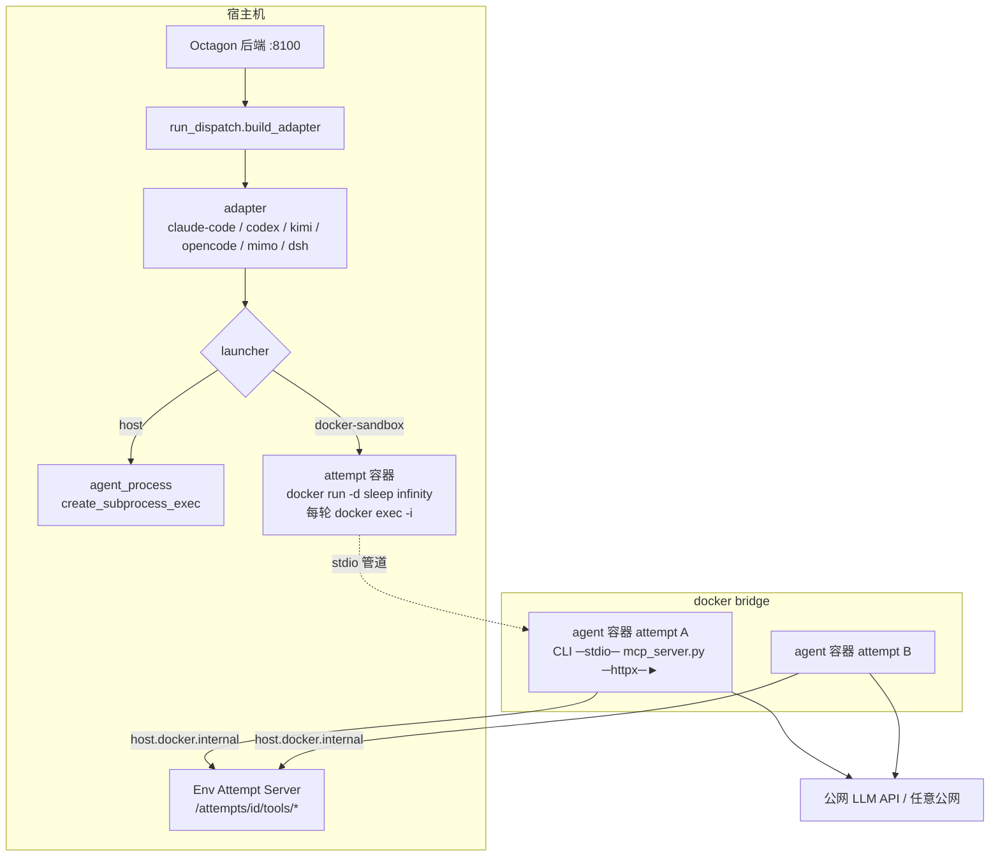

# 技术设计

## 架构概览

沙盒在**进程启动层**接入。CLI adapter 都经 `backend/process/runtime.py::agent_process()` 拉起子进程，然后逐行读 stdout 的 stream-json；多轮 conversation 每轮起一次进程，首轮建 session、后续 resume。dsh 经 SDK 内部 `Popen` 拉起 runtime，走 stdio JSON-RPC，整个 attempt 只起一次。两者的共同点是「管道另一头是一个进程」，沙盒只把这个进程从宿主机换到容器里，adapter 的读流、事件解析、超时、conversation 逻辑不动。

容器的生命周期是 **attempt 级**：adapter `run()` 之前创建（`sleep infinity`），每一轮进程是对它的 `docker exec -i`，`run()` 返回后销毁。



要点：一个 attempt 一个容器；CLI 与场景 MCP server 都在容器内；Env Attempt Server 留在宿主机，容器经 `host.docker.internal` 回连；网络不设围栏。

## Launcher 抽象

两层上下文：attempt 级管容器，turn 级管进程。

```python
# backend/process/launcher.py
@dataclass(frozen=True)
class AttemptSpec:
    attempt_id: str
    run_id: str | None
    data_path: Path
    mounts: Sequence[Mount]    # 沙盒专用；host launcher 忽略
    limits: Limits
    agent_name: str

@dataclass(frozen=True)
class ExecSpec:
    argv: Sequence[str]        # 容器内 argv
    cwd: str                   # 容器内 cwd（同路径挂载下等于宿主机路径）
    env: Mapping[str, str]
    turn_id: str | None

class AgentLaunch(Protocol):
    stdout: asyncio.StreamReader
    stderr: asyncio.StreamReader
    identity: LaunchIdentity   # host: pid/pgid/boot_id；docker: container_id + exec_id
    async def wait(self) -> int: ...
    def kill(self) -> None: ...  # docker: docker kill 整容器

class AttemptSandbox(Protocol):
    container_id: str | None   # host 为 None
    @asynccontextmanager
    async def exec(self, spec: ExecSpec) -> AsyncIterator[AgentLaunch]: ...
    # dsh 专用低层入口：SDK 自己 Popen，只借 argv
    def build_exec_argv(self, spec: ExecSpec) -> tuple[str, ...]: ...
    async def kill(self) -> None: ...

class AgentLauncher(Protocol):
    locus: Literal["host", "docker-sandbox"]
    @asynccontextmanager
    async def attempt(self, spec: AttemptSpec) -> AsyncIterator[AttemptSandbox]: ...
```

- `HostLauncher.attempt()` 是空上下文，`exec()` 包装现有 `agent_process()`，行为零变化，是回归基线。
- `DockerLauncher.attempt()` 进入时 `docker run -d --rm=false --name octagon-agent-<id> --label ... --add-host host.docker.internal:host-gateway <mounts> <limits> --user <uid>:<gid> <image> sleep infinity`，把 container_id 写进 `agent_process.json`；退出时（正常、Stop、超时、异常）`docker kill` + `docker wait`，保证 dispatch 进入 scoring 前容器内没有存活进程（D-11）。
- `AttemptSandbox.exec()` 组装 `docker exec -i -w <cwd> <env 的 -e> <container> <argv>`，`docker exec` 子进程的 stdout/stderr 就是 CLI 的管道，10MB 行缓冲等参数沿用。`docker exec` 客户端进程仍以 `start_new_session=True` 启动，但 `AgentLaunch.kill()` 的权威动作是 `docker kill` 整容器，因为超时是 attempt 级的，没有「只杀一轮继续下一轮」的路径。
- 多轮 conversation、answer_interaction 轮、动态 iteration 轮都在同一个 `attempt()` 上下文内逐轮 `exec()`，CLI 的 session 文件在 `/home/agent` 下跨轮延续，容器内 `/tmp` 等状态也跨轮保留，与宿主机现状一致。
- launcher 由 `build_adapter()` 注入；`sandbox.enabled` 为 true 时给六个本机 agent 的 adapter 注入 `DockerLauncher`，无按 agent 例外。adapter `run()` 的最外层是 `async with launcher.attempt(...)`。

## 边界

### 文件系统

| 宿主机路径 | 容器内路径 | 权限 | 说明 |
|---|---|---|---|
| `<data>/attempts/<id>/skill_workspace` | 同宿主机绝对路径 | rw | 同路径挂载 |
| `<data>/attempts/<id>/sandbox_home` | `/home/agent` | rw | 隔离 HOME |
| `<data>/attempts/<id>/sandbox_ro/` | `/attempt` | ro | 只含 mcp_config、prompt、MCP 入口副本、dsh 的 cordis.yml |

同路径挂载的代价是容器里出现空的目录骨架（如 `/home/<user>/codes/open-agent-octagon/data/attempts/<id>/`），泄露路径名但无内容。

容器用户取宿主机后端进程的 `os.getuid()` / `os.getgid()`，不固定 1000；镜像里 `/home/agent` 用 `chmod 777` 而不是 `chown`，避免 uid 不匹配时 HOME 不可写。mac 上 Docker Desktop 的文件共享层自动映射属主，不传 `--user`。

### MCP 入口翻译

场景当前的 `entrypoints.mcp.command` 形如 `["uv", "run", "--project", ".", "python", "envs/<env>/mcp_server.py"]`，以项目根为 cwd。容器里没有 uv 也没有项目。`run_dispatch._mcp_server_specs()` 在沙盒模式下：取 command 中最后一个 `.py` 参数，相对 `envs_path` 或项目根解析为宿主机文件；拷到 `sandbox_ro/mcp/`；生成 `McpServerSpec(command="python3", args=("/attempt/mcp/<file>",), cwd=<项目根同路径>)`。`docs/environments.md` 既有契约要求 `mcp_server.py` 不 import `core.py`、只经 HTTP 回连后端，所以单文件复制是落实契约而非新增约束。

### 网络

- 容器接默认 bridge，不创建专用网络，不运行代理，出网不限。
- Linux 上传 `--add-host host.docker.internal:host-gateway`，mac 上 Docker Desktop 自带该域名。`OCTAGON_BASE_URL` 与 `sandbox.env_base_url` 使用该域名。
- wire http proxy source 启用时，`WireInjection.llm_base_url` 在 launcher 层做一次 `127.0.0.1 → host.docker.internal` 替换。此时 provider key 可以只留在宿主机代理侧，容器只拿 capture token。
- 服务端工具：`sandbox.server_side_tools` 默认 `allow`。`deny` 时 claude-code 经 settings `permissions.deny` 禁 WebSearch / WebFetch，codex 经 config 关 web search。两态都写 `security_meta.server_side_network`。

### 凭据

provider API key 以容器 env 注入，暴露面等价于当前进程环境变量。env_token 只出现在 `sandbox_ro/mcp_config.json` 与 MCP server 子进程 env。prompt 走 `sandbox_ro/prompt.md` 文件，不进 argv，避免 `ps` 可见与引号问题（Harbor 用随机名环境变量 + stdin 达到同样效果）。

### 资源与安全选项

`--memory` 与 `--memory-swap` 相等（禁 swap）、`--cpus`、`--pids-limit`、`--cap-drop ALL`、`--security-opt no-new-privileges`、Linux 上 `--user <uid>:<gid>`。默认 4g / 2.0 / 1024，比 blade 沙盒的 4g / 4 / 2048 收紧一档，`sandbox.agents.<name>.limits` 可覆盖。

## 生命周期

| 事件 | host | docker-sandbox |
|---|---|---|
| attempt 开始 | — | `docker run -d ... sleep infinity` + 记 `kind: docker`、container_id 到 `agent_process.json` |
| 每轮启动 | `create_subprocess_exec` + 记 pid/pgid/boot_id | `docker exec -i`，记 exec_id 与轮次 |
| 每轮退出 | 进程结束 | exec 结束，容器继续活 |
| 最后一轮退出 | — | `attempt()` 退出：`docker kill` → `docker wait`，然后才返回给 dispatch 进 scoring |
| Stop / 超时 | `killpg` | `docker kill` 整容器 → `docker wait` |
| 后端关停 | 不杀进程 | 不杀容器 |
| 跨重启回收 | pid/pgid/boot_id 判活 | `docker inspect` 判活；`docker ps -f label=` 兜底 |
| 收尾 | — | 各轮 exit code + `docker logs` 尾部 → `sandbox_container.json`，再 `docker rm` |

`backend/process/identity.py::ProcessIdentity` 增加 `container_id`；`lifecycle.kill_recorded_agent_process` 对 docker 类身份改为 `docker kill`。sweeper 增加按标签清理 `exited` 超过宽限期的容器，以及创建后超过 attempt 最大时限仍 `running` 的孤儿容器（后端崩溃后 `attempt()` 上下文没机会退出的情况）。

## 镜像

`docker/agent-runtime/Dockerfile` + `versions.env` + `requirements-envs.txt`。

| 层 | 内容 |
|---|---|
| 基础 | `ubuntu:24.04` |
| 系统 | `python3`、`python3-pip`、`git`、`curl`、`ca-certificates`、`procps`、`build-essential`、`g++`、`ripgrep` |
| 运行时 | `node` 22（npm 安装的 CLI 需要；claude / codex / dsh runtime 是原生二进制） |
| MCP 依赖 | `mcp<2`、`httpx`，与 `uv.lock` 对齐 |
| 场景依赖 | `requirements-envs.txt`（过渡期手工清单）∪ 所有已加载场景 `meta.yaml` 的 `prerequisites.python`，构建脚本合并后 `pip install` |
| CLI | 见下表，每个独立目录、均在 PATH |
| HOME | `/home/agent`，`chmod 777`，运行时 `--user` 决定属主 |

| agent | 安装方式 | 版本钉法 |
|---|---|---|
| claude-code | 官方 `install.sh` 指定版本，原生二进制 | `ARG CLAUDE_VERSION` |
| codex | GitHub release `x86_64-unknown-linux-musl` 静态二进制 | `ARG CODEX_VERSION` |
| kimi-code | pip 包 `kimi-cli` | `ARG KIMI_VERSION` |
| opencode | npm 包 `opencode-ai` | `ARG OPENCODE_VERSION` |
| mimo-code | npm 包，具体包名实施时核（opencode fork） | `ARG MIMO_VERSION` |
| dsh | pip 包 `deepseek-harness-runtime-bin` 内的 `dsh-jsonrpc-agent-pkg-linux-x64`（约 200 MB），构建时从 wheel 抽出到 `/opt/dsh/runtime` | `ARG DSH_VERSION`，与 `pyproject.toml` dsh extra 同步 |

首版镜像六个全收。每个 CLI 的 `--version` 输出写进镜像标签 `octagon.agent.<name>.version`。预计镜像 1.5–2 GB。

### 构建与分发

- `.github/workflows/sandbox-image.yml`，照抄 blade-agent 同名工作流：release tag `sandbox-v*` 或手动触发，`docker/build-push-action` 构建，推阿里云 `registry.cn-beijing.aliyuncs.com` 与 ghcr.io，tag 为 release 版本号。评测机 `docker pull` 阿里云地址。
- `make sandbox-image` 本地构建，tag `octagon-agent-runtime:dev`，只供开发机。
- `sandbox.image` 配置项写完整 `repo:tag`，启动时 `docker image inspect` 取 digest。

## 配置

```yaml
sandbox:
  enabled: false
  image: "registry.cn-beijing.aliyuncs.com/<ns>/octagon-agent-runtime:sandbox-v0.1.0"
  env_base_url: null              # 缺省按 public_base_url 端口推导 host.docker.internal
  limits: {memory: "4g", cpus: 2.0, pids: 1024}
  server_side_tools: allow        # allow | deny；场景 meta.yaml 可覆盖
  agents:
    claude-code: {limits: {memory: "6g"}}
```

## Adapter 改动

| adapter | 改动 |
|---|---|
| claude-code | argv 用镜像 PATH 里的 `claude`，不再 `shutil.which` 宿主机；`--mcp-config /attempt/mcp_config.json`；`CLAUDE_CONFIG_DIR=/home/agent/.claude`；`security_meta` 填 locus / image / container_id / 版本 / server_side_network |
| codex | 同上，`CODEX_HOME=/home/agent/.codex`；`-C <workspace>` 同路径 |
| kimi-code | 同上，`KIMI_CODE_HOME=/home/agent/.kimi`，mcp.json 写到该目录 |
| opencode / mimo-code | 同上，`*_CONFIG_DIR=/home/agent/.config/<cli>`，config `mcp` 段命令翻译 |
| dsh | 见下 |
| blade-agent / ssh-claude-code | 只改 `security_meta`，见下 |
| fake | 不变 |

### dsh

SDK（`deepseek_harness.client`）用 `subprocess.Popen(launch_args_override or default)` 拉起 runtime，stdio JSON-RPC。已核实 `deepseek_harness/api.py` 把 `session_root`、`cordis`、`cwd`、`base_url`、`api_key` 全部打包成 `DSH_SESSION_ROOT` / `DSH_CORDIS_CONFIG` / `DSH_CWD` / `DEEPSEEK_BASE_URL` / `DEEPSEEK_API_KEY` 交给 runtime，SDK 自身不读写这些路径，返回值里只原样带回 `session_root` 字符串。所以沙盒模式：

- adapter `run()` 最外层 `async with launcher.attempt(...)` 拿到 `sandbox`，`launch_args_override = sandbox.build_exec_argv(spec)`，即 `docker exec -i ... <container> /opt/dsh/runtime`；runtime 一次启动服务整个 attempt 的所有轮次，与现状一致；
- SDK 组装的 env 只作用于 docker 客户端进程，adapter 把同一份 env 翻译成 `-e` 放进 argv；
- `cordis.yml` 内的 `cwd`、`session_root`、MCP `cwd` 都是宿主机绝对路径，同路径挂载后原样有效；`dsh_sessions`、`.dsh`、`.agents` 挪到 `sandbox_home`；
- 正常结束：SDK `close()` 发 `shutdown` RPC，runtime 退出，`docker exec` 返回；随后 `attempt()` 退出杀容器。超时硬杀：SDK 只杀 docker 客户端，容器内 runtime 仍在，靠 `attempt()` 退出时的 `docker kill` 收掉，adapter 不需要额外动作，但必须保证 `close()` 在 `attempt()` 上下文内调用；
- runtime 二进制版本与后端 `dsh` extra 钉的同一个，否则 JSON-RPC 协议可能不匹配。

### blade-agent 与 ssh-claude-code

2026-09-09 实测评测机上 blade 沙盒（`blade-sandbox:v0.0.30`）形态：只挂 blade 用户目录（rw）、内置 skill 与 Octagon skill 薄壳（ro）；**每个 blade 用户一个长驻容器**（`sleep infinity`），所有 session 共享 `/root`，残留 18 个历史 session 目录；默认 bridge 网络，公网开放；root，4 GB / 4 CPU / 2048 pids。

答案不可见与本方案等价；差在同 run 内 blade attempt 互相可见（含 `.octagon/attempt.json` 里的 env_token）。Octagon 侧只记录：`security_meta` 加 `sandbox_shared: true` / `egress_policy: unrestricted`；产物回收后删 session workspace 目录、chat 结束即删 attempt.json，减少跨 attempt 残留。不串行、不多账号。

ssh-claude-code 在远端主机跑，`security_meta` 加 `sandbox: none`。两者在 `sandbox.enabled: true` 下照常调度。

## 观测与安全元数据

- `build_security_meta(execution_locus="docker-sandbox", sandbox_image="repo@sha256:...", sandbox_id=<container_id>, workspace_root=<同路径>, permission_mode=<原 flag>)`，另加 `agent_version`、`egress_policy: unrestricted`、`server_side_network`。
- 新增产物 `sandbox_container.json`（镜像 digest、容器 id、exit code、限额、挂载表）。前端执行场合卡片展示它。
- 安全分类器现有 docker-sandbox 前缀推断在同路径挂载下不再需要，保留不影响。

## 测试策略

- **launcher 单测**：`HostLauncher` 与现有 `agent_process()` 行为等价（argv / cwd / env / 记录文件）；`DockerLauncher` 的 `docker run -d` 参数（挂载表、标签、限额、`--user`、`--add-host`）与 `build_exec_argv` 的 `-w` / `-e` / argv 翻译逐项断言，不依赖 docker。
- **多轮生命周期**：mock docker 客户端，断言三轮 conversation 只发生一次 `docker run`、三次 `docker exec`、一次 `docker kill`，且 kill 在 `run()` 返回之前。
- **MCP 入口翻译**：各种 command 形态 → 唯一入口文件；解析失败 → 明确 error_code；自包含静态校验对 `from core import` 报错。
- **docker 集成测试**（无 docker 时 skip）：用一个 fake CLI 脚本替代真实 agent，验证 workspace 同路径可写且属主为宿主机 uid、`/attempt` 只读、`find / -name scorer.py` 为空、`host.docker.internal` 可达后端、agent 退出后容器已被 kill、`docker kill` 后 exit code 与 `sandbox_container.json` 落盘、按标签回收孤儿容器。
- **dsh**：mock SDK 的 `Popen`，断言 `launch_args_override` 是对本 attempt 容器的 `docker exec -i` 且 `-e` 翻译正确；超时路径断言 `close()` 在 `attempt()` 上下文内、且上下文退出时发生了 `docker kill`。
- **失败语义**：镜像缺失 / agent 不在镜像 / docker 不可达 → 对应 error_code，且不出现宿主机执行。
- **镜像**：构建后跑一个 smoke 容器，逐个 CLI `--version` 与镜像标签比对；`python3 -c "import mcp, httpx"` 加 `requirements-envs.txt` 每个包 import。
- 并行约定：默认离线、`tmp_path`、容器名带随机后缀、无固定端口。

## 安全考虑

- 边界是白名单：新增宿主机路径或服务不会自动进入 agent 视野。
- attempt 只读目录必须是单独子目录，整个 attempt 目录挂进去会暴露 adapter 写的执行记录。
- 判分前杀容器：scorer 读的 workspace 不可能被 agent 残留进程同时修改。
- 同路径挂载暴露目录骨架名，不暴露内容。
- 网络不设防是明确决策，`egress_policy: unrestricted` 如实记录；作弊面表里公网一行不因沙盒而改变。
- 沙盒不可用时失败而非回落，避免「以为在沙盒里」。

## 覆盖面自查结论（编码前）

- **谁启动进程**：CLI adapter 每轮经 `agent_process()`（收敛到 `AttemptSandbox.exec()`）；dsh 经 SDK `Popen`（借 `build_exec_argv`）；blade / ssh / fake 不变。容器只在 `attempt()` 进入时起一次。
- **谁消费路径**：场景 MCP server（同路径挂载不翻译）、`security_meta.workspace_root`、安全分类器 locus、产物扫描、前端文件树，同路径挂载让这五处零改动。
- **谁需要回连宿主机**：MCP server → Env Attempt Server；CLI → wire http proxy（启用时）。两者都经 `host.docker.internal`。
- **输入形态**：本机 agent 六种 × 执行场合两种 × wire 启用与否 × server_side_tools 两态。每种结论要么「支持」要么「明确报错」。
- **时序**：`attempt()` 进入起容器 → 逐轮 exec → 最后一轮退出 → `attempt()` 退出 kill 容器 → scoring；Stop 与超时 → `docker kill` 整容器；后端关停不杀；重启后按标签判活；sweeper 清 exited 与超时 running；dsh 硬杀靠 `attempt()` 退出收尾。

## 参考：Harbor 的对应做法

Harbor（Terminal-Bench 2.0 harness，`~/github_codes/harbor`）与本方案的对照，用于说明哪些是抄的、哪些是有意不同：

| 点 | Harbor | 本方案 |
|---|---|---|
| 藏答案 | `tests/` `solution/` 不进镜像，verify 阶段才上传 | `scorer.py` `tasks/` 从不进容器 |
| 判分前处理 | separate-verifier 模式先 stop 主容器再收证据 | 采用：最后一轮退出即 kill 容器 |
| 容器粒度 | 一 trial 一容器，每条命令 `docker exec` | 相同：一 attempt 一容器，每轮 exec |
| 指令传递 | 随机名环境变量 + stdin，不走 argv | 等价：prompt 文件 |
| agent 安装 | 每次 trial 现装进任务镜像 | 有意不同：统一 agent 镜像，钉版本 |
| 容器用户 | root + `IS_SANDBOX=1` | 有意不同：宿主机 uid |
| 网络 | 默认 public，可选 nftables sidecar 白名单 | 只用 public |
| MCP | compose 里独立 service，agent 拿 URL | 单文件复制；HTTP 直出列后续改进 |

## 验证记录

2026-09-09 在 Linux 评测机（Ubuntu 24.04，Docker 29.6）用独立后端副本与真实场景仓库做最小验证，脚本在评测机 `~/octagon-sandbox-poc/`。当时方案含白名单代理，网络相关项已随 D-06 作废，其余结论仍有效：

| 项 | 结果 | 状态 |
|---|---|---|
| 容器内 stdio MCP → httpx → Env Attempt Server → `core.py` | 全链路到达，trace.jsonl / env.db 落盘 | 有效（POC 经代理，正式经 host.docker.internal 直连） |
| `find / -name scorer.py`、场景目录、octagon.db、项目源码、兄弟 attempt | 均不可见 | 有效 |
| 写 `/attempt`、`/etc` | 拒绝 | 有效 |
| 容器 env 含 key / token | 0 | 有效 |
| 宿主机 claude 2.1.245 原生二进制在 ubuntu:24.04 镜像内 | 正常 | 有效（POC 用只读挂载；正式方案进镜像） |
| 直连无路由、经代理白名单放行 / 拒绝 | 通过 | 作废 |

未验证：真实模型在容器内完成一个带 MCP 的任务（评测机无 provider key，脚本已备好）。

2026-09-09 实现后在评测机用 `feat/agent-sandbox` 分支 + `octagon-agent-runtime:dev`
（六个 agent 全收，smoke 全过，digest `sha256:e3394cad…`）跑独立后端（18100）：

| 项 | 结果 |
|---|---|
| 启动检查 | docker 29.6.0 可达，镜像标签六个 agent 齐全 |
| claude-code / travel-planner | 容器 `octagon-agent-<attempt>` 起 → exec 一轮 → claude 在容器内以同路径 cwd 初始化，工具列表含 `mcp__octagon-travel-planner__*`（MCP 入口单文件复制 + host.docker.internal 回连生效）→ 因无登录返回 `Not logged in` → 容器 kill+rm，`sandbox_container.json` / `security_meta.json` 落盘，API `security.meta` 可读 |
| codex / travel-planner | CODEX_HOME 落 `sandbox_home`，容器内打到 api.openai.com 得 401（无 key，预期） |
| 本地 docker 集成测试（python:3.12-slim） | 可见性（scorer.py / octagon.db / 兄弟 attempt 不可见）、`/attempt` 与 `/etc` 只读、宿主机 env 不透传、两轮共用一容器、退出即 kill、按落盘身份杀、按标签扫孤儿 |
